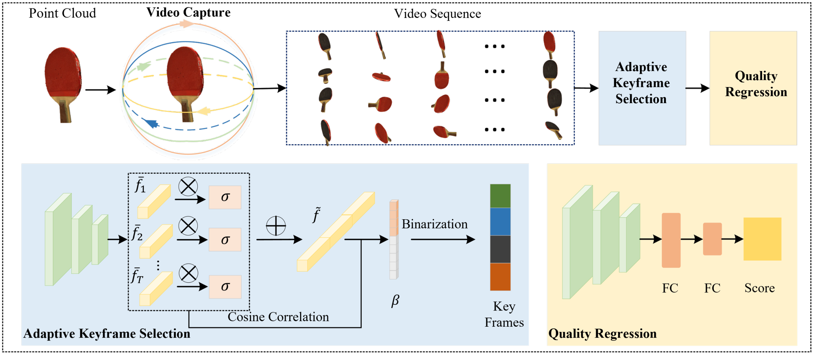
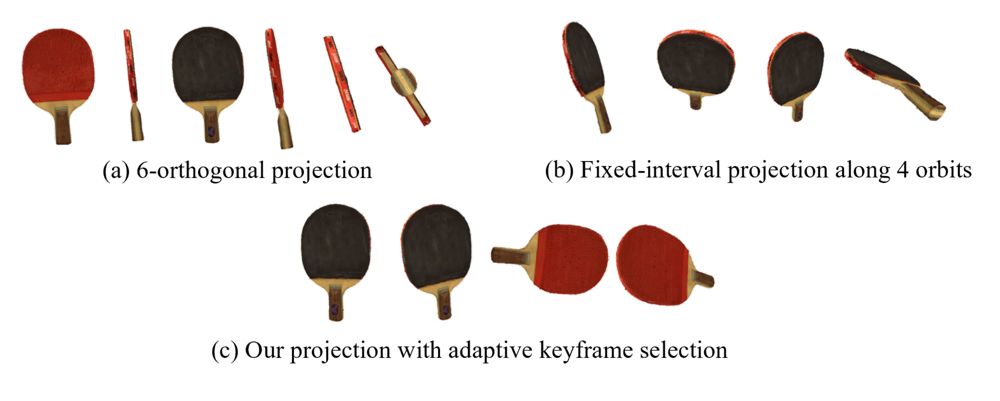
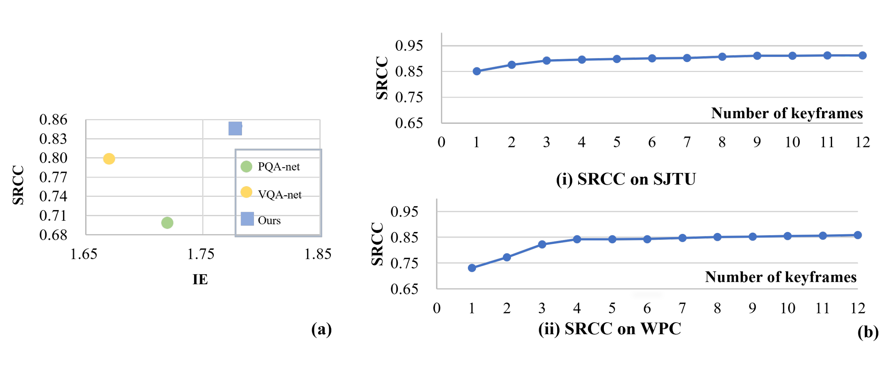

# AKS-Net: No-Reference Point Cloud Quality Assessment with Adaptive Keyframe Selection

[](https://doi.org/10.1109/VCIP63160.2024.10849833)
[](https://opensource.org/licenses/MIT)

This repository contains the official implementation of "No-Reference Point Cloud Quality Assessment with Adaptive Keyframe Selection" presented at the 2024 IEEE International Conference on Visual Communications and Image Processing (VCIP).

## Overview

AKS-Net is a novel no-reference point cloud quality assessment framework that utilizes an adaptive keyframe selection strategy. The method treats point cloud projections as video sequences captured from successive viewpoints and selects the most representative frames for quality assessment.


*Figure: The framework of the proposed method.*

## Key Features

- **3D-to-2D Projection**: Captures 120 frames from 4 symmetric orbits around the point cloud
- **Adaptive Keyframe Selection**: Identifies the most representative frames using attention weights and cosine correlation
- **Quality Regression**: Utilizes selected keyframes to predict the perceptual quality score
- **State-of-the-art Performance**: Superior results on SJTU-PCQA and WPC datasets
- **Improved Generalization**: Better cross-dataset performance compared to existing methods

## Advantages Over Existing Methods


*Figure: Three different point cloud projection strategies, including (a) 6-orthogonal projection, (b) fixed-interval projection along 4 orbits, and (c) our projection with adaptive keyframe selection.*

Compared to existing methods:
- **6-orthogonal projection**: Can lead to information redundancy
- **Fixed-interval projection**: May result in information loss
- **Our adaptive keyframe selection**: Ensures optimal coverage, reducing redundancy and information loss

## Performance

AKS-Net achieves state-of-the-art performance on common point cloud quality assessment benchmarks:

### Comparison with SOTA Methods

| Method    | WPC |       | SJTU |       |
|-----------|-----|-------|------|-------|
|           | SRCC| PLCC  | SRCC | PLCC  |
| PQA-net   | 0.70| 0.71  | 0.84 | 0.86  |
| VQA-net   | 0.80| 0.80  | 0.86 | 0.87  |
| MM-PCQA   | 0.83| 0.83  | 0.91 | 0.92  |
| **Ours**  | **0.85**| **0.86**  | **0.91** | **0.93**  |

### Cross-Dataset Generalization

| Method    | WPC→SJTU |         | SJTU→WPC |         |
|-----------|----------|---------|----------|---------|
|           | SRCC     | PLCC    | SRCC     | PLCC    |
| PQA-net   | 0.54     | 0.61    | 0.18     | 0.17    |
| VQA-PCQA  | 0.57     | 0.63    | 0.13     | 0.30    |
| **Ours**  | **0.88** | **0.90**| **0.24** | **0.31**|


*Figure: (a) Information entropy comparison of different projection methods. (b) Performance with different numbers of keyframes.*

## Installation

```bash
# Clone the repository
git clone https://github.com/YovenLi/AKS-Net.git
cd AKS-Net

# Create environment
conda create -n aksnet python=3.8
conda activate aksnet

# Install PyTorch
conda install pytorch torchvision cudatoolkit -c pytorch

# Install other dependencies
pip install numpy pandas scipy pillow open3d
```

## Usage

### Complete Pipeline

1. **Generate 120 frames from point cloud projections**:
```bash
python train/rotation/rotation.py --path ./ply/ --frame_path ./frames/
```

2. **Extract keyframes**:
```bash
python get_keyframe/get_keyframe.py --database sjtu --num_keyframes 9 --data_dir_frame ./frames/ --output_base_dir ./keyframes/
```

3. **Train quality assessment model**:
```bash
sh train/train_sjtu.sh  # SJTU dataset
sh train/train_wpc.sh   # WPC dataset
```

## Dataset Support

The framework has been evaluated on two public datasets:
- **SJTU-PCQA**: Contains 9 reference point clouds with 7 types of distortions under 6 intensities (378 total)
- **WPC**: Contains 20 reference point clouds with 4 types of distortions (740 total)

## Method Details

### Video Capturing Module
We preset four symmetric orbits (horizontal, vertical, and two ±45° tilted circles) around the point cloud. For each orbit, 30 viewpoints are sampled at 12° intervals, resulting in 120 projected images forming a video sequence.

### Adaptive Keyframe Selection Module
A pre-trained ResNet-18 extracts per-frame features, which are weighted using both coarse attention and fine-grained cosine correlation. The most representative frames are selected through a learned binary index vector optimized with sparsity and mean-margin loss functions.

### Quality Regression Module
The selected keyframes are processed through a pre-trained ResNet-50 network followed by fully connected layers to predict quality scores. The final quality is the average of individual keyframe scores.

## Citation

If you find our work useful for your research, please cite our paper:

```bibtex
@INPROCEEDINGS{10849833,
  author={Wang, Haomiao and Wang, Xiaochuan and Yuan, Xianpeng and Chen, Xianming and Li, Haisheng},
  booktitle={2024 IEEE International Conference on Visual Communications and Image Processing (VCIP)}, 
  title={No-Reference Point Cloud Quality Assessment with Adaptive Keyframe Selection}, 
  year={2024},
  pages={1-5},
  keywords={Point cloud compression;Training;Image quality;Visual communication;Image processing;Video sequences;Redundancy;Particle measurements;Loss measurement;Quality assessment;Point cloud quality assessment;viewpoint selection;keyframe;no-reference;projection-based metrics},
  doi={10.1109/VCIP63160.2024.10849833}
}
```

## License

This project is licensed under the MIT License - see the [LICENSE](LICENSE) file for details.

## Authors

- Haomiao Wang
- Xiaochuan Wang (Corresponding Author): wangxc@btbu.edu.cn
- Xianpeng Yuan
- Xianming Chen
- Haisheng Li

School of Computer and Artificial Intelligence, Beijing Technology and Business University, China 
